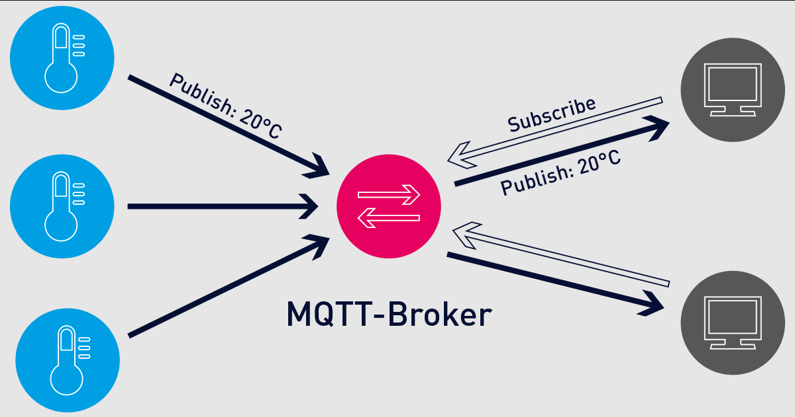

= MQTT
David Thaller
:icons: font
:url-quickref: https://docs.asciidoctor.org/asciidoc/latest/syntax-quick-reference/
:sourcedir: ../src/main/java
:icons: font
:sectnums:    // Nummerierung der Überschriften / section numbering
:toc: left

== Was ist MQTT?
MQTT steht für Message Queuing Telemetry Transport

MQTT ist ein Messaging-Protokoll das für die Kommunikation von Maschine zu Maschine verwendet wird.

== Architektur

=== Was ist ein Broker?
Ein Server, welcher von den Clients benutzt wird.
Der Broker empfängt die Nachricht der Clients und sendet diese zu andere Clients weiter.
Das heißt die Clients kommunizieren nicht direkt mit einander, sondern verbinden sich beide mit dem Broker.

== Tutorial

=== Verbindung zu MQTT herstellen
Zuerst muss die Verbindung zu dem Broker im `application.properties` konfiguriert werden:

[source,shell]
----
mp.messaging.incoming.channelname.connector=smallrye-mqtt

mp.messaging.incoming.channelname.host=public.mqtthq.com

mp.messaging.incoming.channelname.port=1883

mp.messaging.incoming.channelname.topic=topicname/#
----

. Es wird ein MQTT-Connector namens "smallrye-mqtt" verwendet.

. Es wird zum öffentlichen MQTT-Broker "public.mqtthq.com"

. auf Port 1883 verbunden.

. Die Nachrichten werden dann unter "topicname/#" empfangen. Die Raute steht für alles was nach "topicname/" kommt.

NOTE: `channelname` ist ein frei erfundener Name, welcher anschließend im Code mittels der `@Incoming` Annotation referenziert  wird.

Zum Testen, ob die Nachrichten dann auch ankommen, habe ich einen online https://mqtthq.com/client[MQTT Web Client] gefunden.
Natürlich muss der Name des Topics übereinstimmen.

=== Einen Empfänger erstellen
[source, java]
----
@ApplicationScoped
public class MqttReceiver {

    private Logger logger = Logger.getLogger(MqttReceiver.class.getName());

    @Incoming("channelname")
    public void receiveMessage(byte[] byteArray) {
        String messageString = new String(byteArray);
        logger.info("Received raw message: " + messageString);
    }

}
----
Die Methode `getLogger()` sucht einen Logger und wenn ein Logger mit dem übergebenen Namen existiert, gibt die Methode diesen Logger zurück.
Andernfalls erstellt die Methode einen neuen Logger mit diesem Namen und gibt diesen zurück.

Die Methode `receiveMessage()` akzeptiert ein Byte-Array als Eingabe und konvertiert es dann in ein String.
Der Logger protokolliert die Message.

==== Starten
[source, shell]
----
./mvnw quarkus:dev
----

Wenn dein Quarkus Projekt erfolgreich gebaut, hat sollte folgendes ausgeben werden:
[source, shell]
----
Connection with public.mqtthq.com:1883 established successfully
Connection with public.mqtthq.com:1883 established successfully
Subscription outcome: Future{result=0}
----

Sollten Probleme bezüglich des Ports auftreten, versuche dies:
[source, shell]
----
netstat -anop | grep

kill -9 <ProzessID>
----

=== Einen Sender erstellen
==== `application.properties` konfigurieren:

[source,shell]
----
# Outbound
mp.messaging.outgoing.channelname2.connector=smallrye-mqtt

mp.messaging.outgoing.channelname2.host=public.mqtthq.com

mp.messaging.outgoing.channelname2.port=1883

mp.messaging.outgoing.channelname2.topic=topicname/
----

Zum Senden muss logischerweise `outgoing` und ein anderer beliebiger Channelname verwendet werden.

==== Code
[source, java]
----
@ApplicationScoped
public class MqttSender {

    @Outgoing("channelname2")
    public byte[] sendMessage() {
            return "Hello i am David!".getBytes();
        }

    }
----

IMPORTANT: Es wird ständig die Message gesendet. Bedauerlicherweise habe ich es noch nicht geschafft dieses Problem zu beheben.

=== Testen
Wie schon bereits im obigen Text beschrieben, kann nun unser Nachrichtenempfänger mittels einem online https://mqtthq.com/client[MQTT Web Client] geprüft werden, ob auch wirklich Nachrichten ankommen.

TIP: https://smallrye.io/smallrye-reactive-messaging/smallrye-reactive-messaging/3.4/mqtt/mqtt.html[Quelle]

